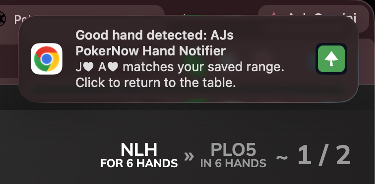
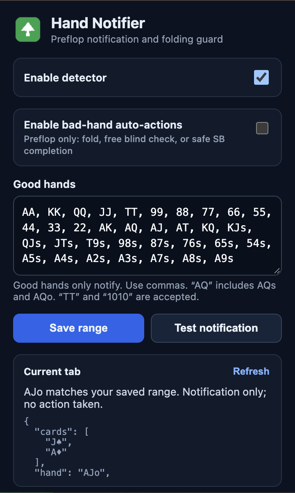

# PokerNow Hand Notifier + Preflop Guard

A zero-build Chrome Manifest V3 extension that watches your visible PokerNow starting hand.

> **Compatibility:** This extension works only in PokerNow's **No Limit Hold'em** mode. Other PokerNow game modes are not supported.

## Disclaimer

This project is provided for educational and software demonstration purposes. It does not promote cheating, collusion, technology-assisted play in poker, or real-money gambling. PokerNow may restrict or prohibit tools like this under its current terms, and individual tables may have additional rules. Review and follow PokerNow's current terms, table rules, and applicable laws. You are responsible for how you use this software; use it only where permitted.

## Screenshots

<table>
	<tr>
		<th>Good-hand notification</th>
		<th>Extension popup</th>
	</tr>
	<tr>
		<td></td>
		<td></td>
	</tr>
</table>

## Behavior

### Good hands

The default good-hand range is:

- AA, KK, QQ, JJ, TT, 99, 88, 77, 66
- AKs, AKo
- AQs, AQo
- AJs, ATs
- KQs, KQo
- KJs, QJs, JTs

When a good hand is detected, the extension **sends a Chrome notification with a bundled local chime**. It never clicks any poker action for a good hand.

### Live hand reaches the flop

When exactly three community cards appear, the extension sends one additional
notification with the same bundled local chime if both hero cards are still visible and the hero seat is not
marked folded. This is useful after a free blind check. Clicking the alert
returns to the correct PokerNow tab.

This feature is notification-only. The extension never checks, calls, folds,
bets, or raises after any community card is visible.

### Hands outside the saved range

Automatic actions are limited to the preflop round:

- Outside the blinds: fold.
- Small blind: check when PokerNow offers a genuinely free Check and no Call option is visible (for example, an unraised 1/1 game). Otherwise, call only when the displayed call amount is no more than the small blind. In a 1/2 game, this means it may call exactly 1 to complete to 2. If a Call option is visible and the amount is larger or cannot be parsed safely, fold.
- Big blind: check only when no Call option is present. If a Call option appears—even briefly alongside Check—it folds. It never calls from the big blind.
- Postflop: do nothing under every circumstance.

## Safety design

The extension is intentionally fail-closed:

- A recognized, empty community-card area is required before any click.
- Once any community card has appeared, automatic actions are disabled for the rest of that deal.
- It requires an explicit PokerNow hero-turn signal. Visible Fold/Check/Call controls alone are treated as out-of-turn pre-action toggles and are never clicked.
- The same action decision must remain unchanged across two scans before clicking.
- Small-blind checks require no visible Call option. Small-blind calls require confidently detected SB and BB values and a call amount no larger than the SB.
- Ambiguous blind or call values never produce a call.
- Good hands are blocked from the automatic-action path before buttons are evaluated.
- No raise, bet, or all-in code exists in the extension.

## Install or update

1. Extract the ZIP.
2. Open `chrome://extensions`.
3. Enable **Developer mode**.
4. Remove the old unpacked version, or click **Reload** after replacing its files.
5. Click **Load unpacked** and select the extracted `pokernow-hand-notifier` folder containing `manifest.json`.
6. Reload all open PokerNow game tabs.
7. Open the extension popup and verify both toggles.

The extension has no build step and no runtime dependencies.

## Popup controls

- **Enable detector** controls all card detection and notifications.
- **Enable bad-hand auto-actions** controls every automatic click. It is enabled by default.
- Editing the good-hand range during an existing deal will not start automatic play for that already-dealt hand. The new setting takes effect safely on a later deal.

The popup's live diagnostics show:

- cards and normalized hand;
- whether the hand matches the range;
- board recognition and visible-card count;
- detected position and active player count;
- small blind, big blind, and call amount;
- available Fold, Check, and Call buttons;
- whether PokerNow indicates it is your turn;
- whether an automatic action has already been handled for the deal.

## Testing included

Run from the extension folder:

```bash
node tests/test-hand-utils.js
node tests/test-action-utils.js
node tests/test-preaction-regression.js
node tests/test-safety-invariants.js
```

These tests cover hand parsing, all permitted decision branches, heads-up blind mapping, postflop rejection, no-turn rejection, and static safety invariants.

## Privacy

Everything runs locally inside Chrome. The extension has no external server, remote code, email service, SMS integration, analytics, or network requests.


## Version 1.1.1

Fixed a big-blind race condition: a visible Call button now takes priority over any simultaneously rendered Check button, so a raised big blind folds instead of attempting to check.


## Version 1.1.2

Fixed intermittent missed preflop actions in two places:

- Version 1.1.2 added a guarded button-only turn fallback. Version 1.1.3 removes that fallback because PokerNow also shows those controls as out-of-turn pre-action toggles.
- A DOM `.click()` can occasionally be ignored during a React transition. Version 1.1.2 added retries; version 1.1.3 supersedes that behavior with one click per exact decision state to avoid toggling PokerNow pre-actions.
- Action buttons are selected only from a visible decision panel, avoiding stale transition controls elsewhere in the DOM.
- Big-blind checks, small-blind free checks, and small-blind completions use a longer stability window than folds, preventing a late raise update from being mistaken for a free action.


## Version 1.1.3

Fixed queued-action handling when the hero is in a blind:

- PokerNow renders toggleable Check/Call/Fold pre-actions before it is your turn. The extension now requires an explicit hero-turn signal and never clicks from buttons alone.
- Automatic actions are clicked only once per exact live decision state, preventing PokerNow pre-action toggles from being switched on, off, and on again. If a Check state later changes to Fold after a raise, the Fold is a new state and receives its own single click.
- Using the single click pauses only that unchanged action state if PokerNow does not acknowledge it; the extension continues monitoring the hand for raises and other preflop changes.


## Version 1.1.4

Fixed the small-blind free-check branch:

- If the hero is confirmed to be on turn in the small blind, PokerNow shows Check, and no Call option is visible, the extension checks instead of folding. This covers equal-blind games such as 1/1.
- If Check and Call are both visible, Call takes priority as evidence that chips may be owed. The extension then performs only the already-allowed safe completion or folds; it never uses the stale Check.
- Small-blind free checks use the same longer stability confirmation as other blind exceptions.


## Version 1.1.5

Fixed suited and offsuit recognition:

- Card identity classes are now read from both the outer `.card-container` and inner `.card` elements.
- Added fallbacks for reverse card classes, suit-name classes, `data-card`, `data-suit`, `aria-label`, and title attributes.
- Range entries now accept both shorthand (`AKs`, `AKo`) and plain English (`AK suited`, `AK offsuit`, `AK off-suit`).
- If a non-pair hand's suits still cannot be determined, it remains unparsed and the extension takes no automatic action.


## Version 1.1.6

Fixed the remaining all-spades parsing bug and updated the default notification range:

- The parser now ignores decorative `.sub-suit` elements and reads only the card's main `.suit:not(.sub-suit)` identity.
- Exact card classes and attributes take priority; conflicting or ambiguous suits resolve to unknown rather than spades.
- The new default range is AA, KK, QQ, JJ, TT, 99, 88, 77, 66, AK, AQ, AJs, ATs, KQ, KJs, QJs, JTs.
- Existing installations using the previous untouched default range are migrated automatically. Custom ranges are preserved.


## Version 1.1.8

- Fixes PokerNow suit nodes that carry a generic `s` styling class on every card.
- Prioritizes explicit card-local classes such as `su-diamonds`, `su-clubs`, `su-hearts`, and `su-spades`.
- Ignores bare single-letter suit text/classes during live DOM extraction.
- Adds compact per-card suit diagnostics to the popup live scan.


### v1.1.8 suit parsing fix

PokerNow currently encodes each card as `card-{suit}` plus `card-s-{rank}`.
For example, `card-d card-s-A` is the ace of diamonds; `card-h card-s-5`
is the five of hearts. The visible `.suit` and `.suit.sub-suit` spans also
expose `s`, `c`, `h`, or `d` through their `::before` pseudo-element. This
version reads those exact card-local values and no longer interprets
`card-s-{rank}` as spades.


## Version 1.1.9

- Adds a one-time flop-arrival notification when exactly three community cards are visible and both hero cards remain visible.
- The flop alert works independently of whether the starting hand matched the saved range or could be fully classified as suited/offsuit.
- Postflop remains strictly notification-only: no postflop action buttons are read or clicked.
- Adds a 90-second same-hand fingerprint guard to prevent duplicate flop alerts during PokerNow React re-renders.


## Version 1.2.0

- Adds a bundled local notification chime for good-hand, flop-arrival, and test notifications.
- Uses a Manifest V3 offscreen audio document, so the sound works while the PokerNow tab is in the background.
- The sound file is packaged inside the extension; there are no external requests or paid services.
- Platform notification audio is silenced to avoid a double sound when the operating system also generates a notification tone.
